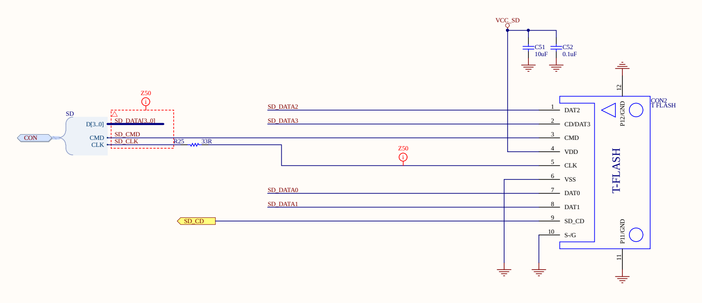
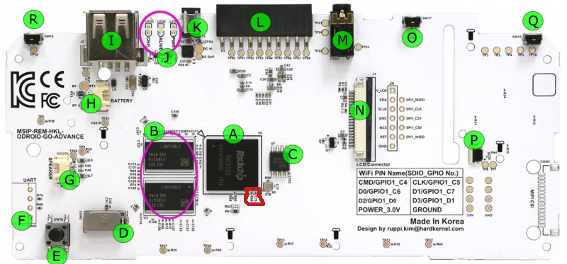

# Odroid-go-advance-no-sd-fix

How to fix an OGA Odroid go advance with no sd card problem.

### number:1

* Check your SD card if its not faulty with F3 tool

### number:2

* Check rezistor number R25. (If its not there or its faulty then it will display NO SD card.)
* The rezistor must be a 33R (R25) and is needed for sd detection.

* Where C25 is located.
* Its the left one.

### Note

* on some PCBs its labled differently. (But should be in the same place.)

